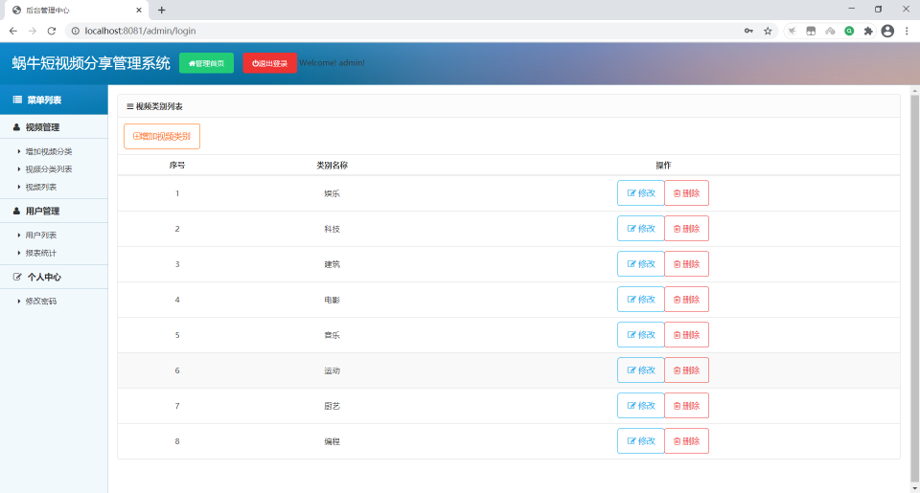
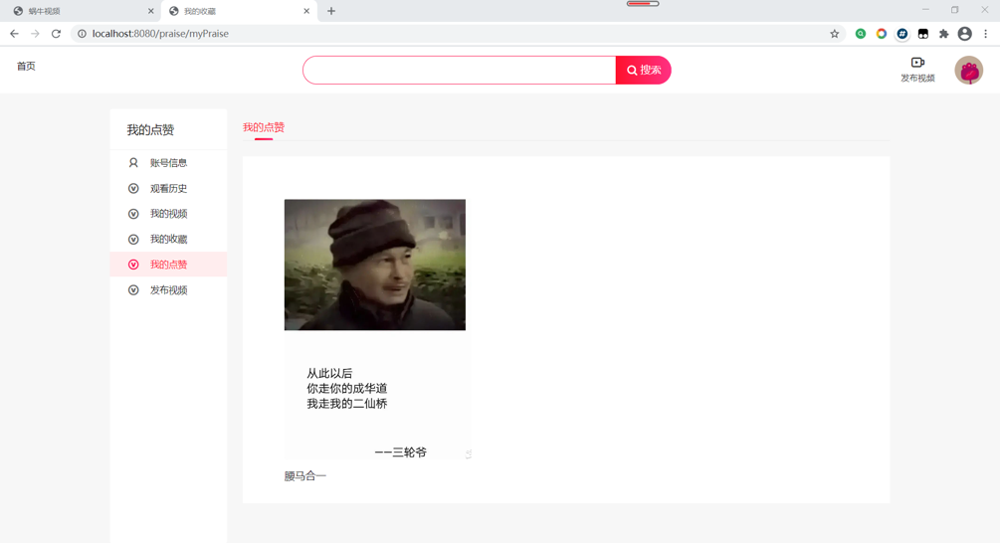

### 短视频分享网站

本项目基于maven+springboot开发。

##### 项目思维导图：

##### E-R图：

##### 项目结构：

本项目包括两个大的模块，即管理员端好用户端。

### 1.管理员端

登录

视频类别

视频列表

用户列表

修改密码

### 2.用户端

注册

登录

首页

视频播放

#### 个人中心：

账号信息

观看历史

我的视频

我的收藏

我的点赞

发布视频

